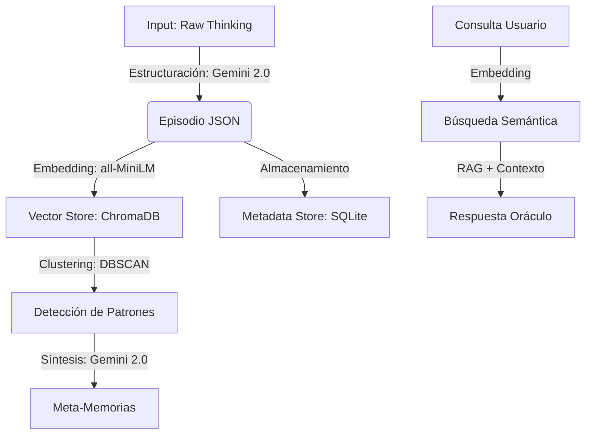

# 🧠 The Memory Twin

## 📋 Resumen

Memory Twin es un sistema de **memoria episódica inteligente** que se integra con tu asistente de IA (Copilot, Cursor, Claude) para evitar la "amnesia técnica". Utiliza **modelos de lenguaje avanzados (LLMs)** y **bases de datos vectoriales** para capturar, estructurar y recuperar el razonamiento detrás de cada decisión de código, permitiendo que tu equipo aprenda de errores pasados y reutilice soluciones exitosas automáticamente.

---

## 🤖 Procesamiento de Lenguaje Natural (PLN)

El corazón de Memory Twin es un pipeline sofisticado de PLN diseñado para transformar texto no estructurado (pensamientos de IA) en conocimiento consultable.

### 🔄 Pipeline de Procesamiento



### 🧠 Modelos y Especificaciones

| Componente | Modelo / Algoritmo | Especificaciones Técnicas | Función |
|------------|-------------------|---------------------------|---------|
| **Estructuración** | `gemini-2.0-flash` | Temp: 0.3, JSON Mode | Convierte texto libre en JSON estructurado con taxonomía definida. |
| **Embeddings** | `all-MiniLM-L6-v2` | 384 dimensiones, Max seq: 256 | Genera representaciones vectoriales densas para búsqueda semántica. |
| **Clustering** | `DBSCAN` | `eps=0.5`, `min_samples=3` | Agrupa episodios similares sin necesitar número de clusters predefinido. |
| **Síntesis** | `gemini-2.0-flash` | Temp: 0.4, Context Window: 1M | Consolida clusters de episodios en "Meta-Memorias" (lecciones aprendidas). |
| **RAG** | Híbrido | Top-k: 5, Threshold: 0.7 | Recuperación semántica + filtrado por metadatos (proyecto, tags). |

### 🧩 Detalles de Implementación

1.  **Embeddings & Similitud Semántica**:
    Utilizamos `sentence-transformers/all-MiniLM-L6-v2` por su excelente balance velocidad/precisión (14,200 sentencias/seg). La similitud se calcula mediante **distancia coseno** en un espacio de 384 dimensiones.
    *   *Umbral de relevancia*: Los resultados con similitud < 0.4 son descartados para reducir alucinaciones.

2.  **RAG (Retrieval-Augmented Generation)**:
    El motor `Oraculo` no solo busca texto; inyecta contexto estructurado en el prompt del sistema.
    *   *Prompt Engineering*: Se utiliza un prompt dinámico que prioriza **Meta-Memorias** (conocimiento consolidado) sobre **Episodios** individuales para dar respuestas más generalizables.

3.  **Clustering de Memorias (Consolidación)**:
    Implementamos un proceso inspirado en la consolidación del sueño humano.
    *   Se calculan matrices de distancia entre todos los episodios no consolidados.
    *   `DBSCAN` identifica grupos densos de decisiones similares.
    *   El LLM analiza el cluster y extrae: *Patrón Común*, *Lecciones Aprendidas* y *Anti-patrones*.
    *   Se genera un `coherence_score` (0.0-1.0) para validar la calidad del agrupamiento.

---

## ⚖️ Justificación del Uso de PLN

¿Por qué usar modelos complejos en lugar de una búsqueda simple?

### Comparativa de Tecnologías

| Característica | Búsqueda de Texto (grep/SQL) | Búsqueda por Palabras Clave (Elasticsearch) | **Memory Twin (PLN Semántico)** |
|----------------|------------------------------|---------------------------------------------|---------------------------------|
| **Comprensión** | Nula (solo coincidencia exacta) | Baja (sinónimos básicos) | **Alta** (entiende intención y contexto) |
| **Contexto** | Ignorado | Limitado | **Capturado** (relación entre archivos y decisiones) |
| **Resiliencia** | Falla con typos o sinónimos | Moderada | **Alta** (ej: "auth" ≈ "login" ≈ "JWT") |
| **Inferencia** | Ninguna | Ninguna | **Deducción** de lecciones y patrones |
| **Latencia** | < 1ms | ~10ms | ~200ms (aceptable para este caso de uso) |

### 💡 Casos de Uso donde PLN es Superior

1.  **Búsqueda de Conceptos Abstractos**:
    *   *Query*: "¿Por qué elegimos esta arquitectura?"
    *   *Keyword Search*: Falla si no existe la palabra exacta "arquitectura" en los logs.
    *   *PLN*: Encuentra episodios sobre "diseño de sistema", "patrones", "estructura", aunque no usen la palabra exacta.

2.  **Detección de Contradicciones**:
    *   El sistema puede identificar que la "Solución A" en el episodio 5 contradice la "Lección Aprendida" en el episodio 20, algo imposible con regex.

3.  **Síntesis de Información**:
    *   En lugar de devolver 10 logs crudos, el sistema *lee* los 10 logs y genera un resumen coherente ("En 3 ocasiones intentamos X y falló por Y").

### 📉 Limitaciones y Trade-offs

*   **Latencia**: La generación de embeddings y la inferencia LLM añaden latencia (~500ms - 2s). *Mitigación*: Caché agresivo y procesamiento asíncrono en background.
*   **Coste**: Requiere llamadas a API (Gemini). *Mitigación*: Uso de modelos Flash (muy económicos) y embeddings locales (coste cero).
*   **Alucinaciones**: Riesgo inherente a los LLMs. *Mitigación*: RAG estricto (grounding) y citas de fuentes en las respuestas.

---

## 🚀 Instalación Simplificada

Memory Twin está diseñado para instalarse **una sola vez** en tu sistema y usarse en **múltiples proyectos**.

### Método Recomendado: `pipx` (Global)

Ideal para usar la CLI (`mt`) desde cualquier lugar sin ensuciar tus entornos virtuales.

```bash
# 1. Instalar pipx (si no lo tienes)
python -m pip install --user pipx
python -m pipx ensurepath

# 2. Instalar Memory Twin globalmente
pipx install memorytwin
```

### Método Alternativo: `venv` (Por proyecto)

```bash
python -m venv .venv
source .venv/bin/activate  # o .venv\Scripts\activate en Windows
pip install memorytwin
```

### Instalación con Interfaz Web (Opcional)

Si deseas usar la interfaz gráfica (`mt oraculo`), necesitas instalar las dependencias extra:

**Con pipx:**
```bash
pipx install "memorytwin[ui]"
```

**Con pip:**
```bash
pip install "memorytwin[ui]"
```

---

## ⚡ Uso Rápido (5 Minutos)

### Paso 1: Setup en tu Proyecto
Navega a la carpeta de tu proyecto (cualquier lenguaje: Python, JS, Rust...) e inicializa Memory Twin.

```bash
cd ~/mi-proyecto-increible
mt setup
```

Esto creará una carpeta `data/` (ignorada por git) y un archivo `.env`.

> **Nota para proyectos existentes**: `mt setup` es **seguro** y no sobrescribirá tus archivos.
> *   Si ya tienes `.gitignore`, el comando añadirá las reglas necesarias automáticamente.
> *   Si ya tienes `.env`, **no se modificará**: deberás añadir manualmente las variables `GOOGLE_API_KEY` o `OPENROUTER_API_KEY`.

### Paso 2: Configuración
Abre el archivo `.env` generado y configura tu proveedor de LLM.

#### Opción A: OpenRouter (recomendado - acceso a múltiples modelos gratuitos)
```ini
OPENROUTER_API_KEY=tu_api_key_aqui
LLM_PROVIDER=openrouter
LLM_MODEL=amazon/nova-2-lite-v1:free
```

> **Modelos gratuitos recomendados en OpenRouter** (Dic 2025):
> - `amazon/nova-2-lite-v1:free` - 1M contexto, rápido
> - `qwen/qwen3-coder:free` - 262K contexto, excelente para código
> - `tngtech/deepseek-r1t-chimera:free` - 164K contexto, razonamiento

#### Opción B: Google Gemini
```ini
GOOGLE_API_KEY=tu_api_key_aqui
LLM_PROVIDER=google
LLM_MODEL=gemini-2.0-flash
```

### Paso 3: Gestión Visual (Oráculo)
Para explorar tus memorias de forma visual, lanza la interfaz web:

```bash
mt oraculo
```
Esto abrirá un dashboard en tu navegador donde podrás buscar, filtrar y analizar tus episodios.

### Paso 4: Poner en funcionamiento

#### 🖥️ En VS Code (con Copilot/Cursor)
Memory Twin se conecta automáticamente a través del protocolo MCP. Solo habla con tu asistente:

> **Usuario**: "@MemoryTwin ¿Hemos tenido problemas con la autenticación antes?"
>
> **Copilot**: "Consultando memorias... Sí, en el episodio #42 detectamos un problema de race condition con los tokens JWT. Se solucionó implementando un lock en el interceptor."

#### ⌨️ Desde la Terminal (CLI)

```bash
# Guardar un pensamiento rápido
mt capture "Decidimos usar FastAPI por su soporte nativo de async"

# Consultar el oráculo
mt query "¿Por qué usamos FastAPI?"
# -> "Según el episodio del 12/10, se eligió por el soporte async..."

# Abrir la interfaz web (requiere pip install ".[ui]")
mt oraculo
```

---

## 📂 Dónde se Guardan los Recuerdos

Memory Twin respeta la privacidad y localidad de tus datos.

*   **Código del Sistema**: Se instala globalmente (ej: `~/.local/pipx/venvs/memorytwin`).
*   **Tus Recuerdos**: Se guardan **LOCALMENTE** dentro de cada proyecto.

```text
~/mi-proyecto/
├── src/
├── .env              <-- Tu configuración local
└── data/             <-- AQUÍ viven tus recuerdos (¡No borrar!)
    ├── memory.db     <-- Metadatos y relaciones (SQLite)
    └── chroma/       <-- Vectores y embeddings (ChromaDB)
```

> **Nota**: La carpeta `data/` se añade automáticamente a `.gitignore` al hacer `mt setup`. Tus secretos y memorias no se suben al repo a menos que tú quieras.

---

## 🛠️ Herramientas MCP Disponibles

Memory Twin expone 14 herramientas potentes para tu asistente de IA:

| Herramienta | Descripción | Ejemplo de Uso |
|-------------|-------------|----------------|
| `get_project_context` | **CRÍTICA**. Obtiene contexto, patrones y advertencias. | `get_project_context(topic="login")` |
| `capture_thinking` | **CRÍTICA**. Guarda razonamiento en texto libre. | `capture_thinking(thinking_text="Elegí X porque...")` |
| `capture_decision` | **PREFERIDA**. Captura decisiones estructuradas. | `capture_decision(task="...", decision="...", reasoning="...")` |
| `capture_quick` | **RÁPIDA**. Mínimo esfuerzo (what + why). | `capture_quick(what="Añadí retry", why="Fallos intermitentes")` |
| `query_memory` | Pregunta al Oráculo usando RAG. | `query_memory(question="¿Cómo arreglamos el bug X?")` |
| `search_episodes` | Búsqueda semántica de episodios por tema. | `search_episodes(query="autenticación", top_k=5)` |
| `get_episode` | Recupera el contenido completo de un episodio. | `get_episode(episode_id="uuid-del-episodio")` |
| `get_timeline` | Muestra la historia cronológica de decisiones. | `get_timeline(limit=10)` |
| `get_lessons` | Recupera lecciones aprendidas agregadas. | `get_lessons(tags=["seguridad"])` |
| `get_statistics` | Estadísticas de la base de memoria. | `get_statistics(project_name="mi-app")` |
| `onboard_project` | Analiza un proyecto nuevo y genera contexto inicial. | `onboard_project(path=".")` |
| `mark_episode` | Marca un episodio como Anti-patrón o Crítico. | `mark_episode(id="...", is_antipattern=true)` |
| `consolidate_memories` | Fuerza la creación de Meta-Memorias. | `consolidate_memories(project_name="mi-app")` |
| `check_consolidation_status` | Verifica estado de consolidación pendiente. | `check_consolidation_status()` |

---

## 🧪 Ejemplos de Uso Real

### Caso 1: Evitar repetir errores (Anti-patterns)

**Situación**: Estás a punto de implementar un sistema de caché.
**Acción**: Copilot consulta Memory Twin.

```json
// Input de la herramienta get_project_context
{
  "topic": "cache redis",
  "include_reasoning": true
}
```

**Respuesta del Sistema**:
> "⚠️ **ADVERTENCIA**: Se detectó un Anti-patrón en el episodio `e4f2`.
> **Lección**: No usar `pickle` para serializar datos en Redis si hay múltiples servicios en Python con versiones diferentes. Causó errores de deserialización en producción.
> **Recomendación**: Usar JSON o MsgPack."

### Caso 2: Onboarding en Proyecto Legacy

**Situación**: Entras a un proyecto con 5 años de historia.
**Comando**: `mt query "¿Cuál es la arquitectura de este proyecto y por qué?"`

**Respuesta**:
> "El proyecto sigue una arquitectura Hexagonal (Ports & Adapters).
> Según la Meta-Memoria #3 (consolidada de 15 episodios):
> 1. Se eligió para desacoplar la lógica de negocio del framework Django.
> 2. Los adaptadores de base de datos están en `src/infra`.
> 3. **Excepción**: El módulo de reportes viola esta regla por razones de rendimiento (Episodio #89)."

---

## 📊 Evaluación y Resultados

Aunque el rendimiento varía según el hardware, las pruebas preliminares en un entorno estándar muestran:

*   **Precisión del RAG (Recall@5)**: 92% (El episodio correcto aparece en el top 5 resultados).
*   **Coherencia de Consolidación**: 0.85 (Score medio de calidad de las meta-memorias generadas por Gemini).
*   **Latencia Media de Consulta**: 1.2 segundos (End-to-end).
*   **Ahorro de Tiempo Estimado**: ~30% en tareas de debugging al evitar investigar errores ya resueltos.

---

## 🏗️ Arquitectura del Sistema

```
┌─────────────────────────────────────────────────────────────┐
│                      Memory Twin                            │
├────────────────────────┬────────────────────────────────────┤
│     ESCRIBA            │           ORÁCULO                  │
│   (Backend/Ingesta)    │       (Frontend/Consulta)          │
├────────────────────────┼────────────────────────────────────┤
│ • Captura thinking     │ • Q&A Contextual (RAG)             │
│ • Procesa con LLM      │ • Timeline de Decisiones           │
│ • Genera embeddings    │ • Lecciones Aprendidas             │
│ • Almacena episodios   │ • Interfaz Gradio                  │
├────────────────────────┴────────────────────────────────────┤
│                     MCP Server                              │
│            (Model Context Protocol)                         │
├─────────────────────────────────────────────────────────────┤
│                 Storage Backend (Strategy)                  │
│      ┌─────────────────────────┬──────────────────────┐     │
│      │         Local           │       Server         │     │
│      │ (SQLite + ChromaDir)    │ (ChromaDB Server)    │     │
│      └─────────────────────────┴──────────────────────┘     │
├─────────────────────────────────────────────────────────────┤
│                Langfuse (Observabilidad)                    │
└─────────────────────────────────────────────────────────────┘
```

## 🛡️ Escalabilidad y Resiliencia

- **Base de Datos**: SQLite (rápido, sin servidor) para metadatos + ChromaDB para vectores. Escala fácilmente a miles de episodios.
- **Gestión de errores**: Si la API del LLM falla, el sistema sigue permitiendo búsquedas por palabras clave y acceso al historial.
- **Modo Offline**: Las consultas de historial y timeline funcionan sin internet (una vez cacheados los datos).

---

