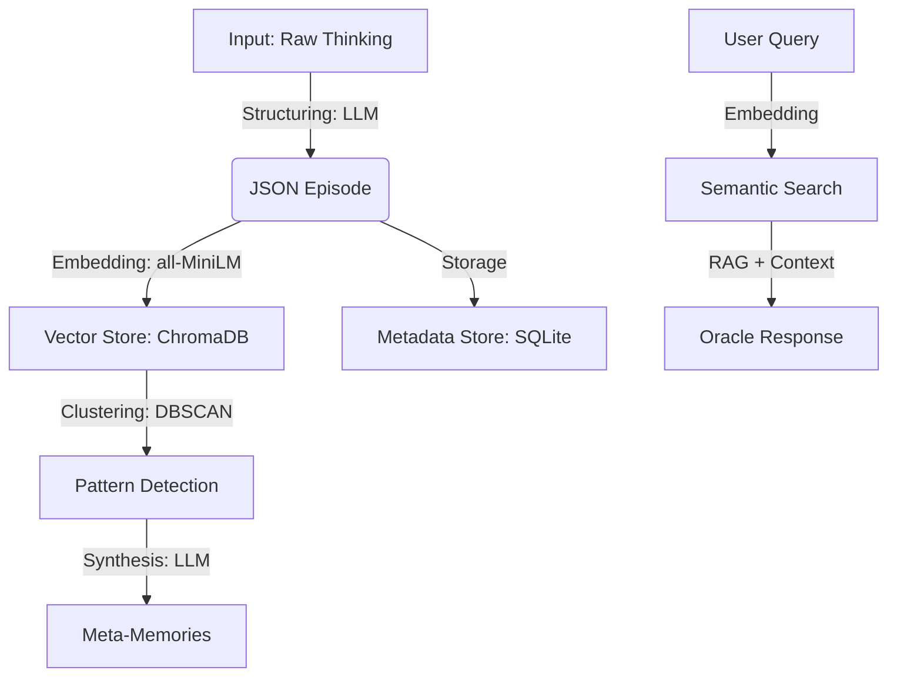

# Memory Twin

## Overview

Memory Twin is an **intelligent episodic memory system** that integrates with your AI assistant (Copilot, Cursor, Claude) to prevent "technical amnesia." It uses **large language models (LLMs)** and **vector databases** to capture, structure, and retrieve the reasoning behind every code decision, enabling your team to learn from past mistakes and automatically reuse successful solutions.

## Recruiter Snapshot

**Portfolio Positioning**: Secondary project (advanced AI/backend tooling), not a business-facing flagship product.

**What this project demonstrates**:
- End-to-end AI engineering: LLM structuring + embeddings + RAG + MCP integration.
- Software engineering fundamentals: modular architecture, test suite, CI checks, packaging, and CLI UX.
- Practical trade-off thinking: latency/cost/hallucination mitigation and fallback behavior design.

**Evidence in this repository**:
- Automated CI pipeline: lint + tests ([.github/workflows/ci.yml](.github/workflows/ci.yml)).
- Broad automated test coverage by module (120 tests passing in local validation).
- Runnable local system with CLI, MCP server, and optional UI.

**Scope honesty**:
- This is an engineering portfolio project in **alpha stage**.
- It proves technical depth and implementation quality; it is not positioned as a production SaaS with external customer metrics.

---

## Public Observability Trace (Course Deliverable)

To satisfy the course requirement for monitored, public traces, this repository includes a public Langfuse trace:

- **Langfuse Public Trace**: [View trace](https://cloud.langfuse.com/project/cmiq9jkds005rad065xzlt8p8/traces/650709800524916eb6c18deffdc35fa4?timestamp=2025-12-10T01:41:30.876Z)

> This link is provided as evidence of real instrumentation in a running flow, aligned with the class deliverables.

---

## Natural Language Processing (NLP) Pipeline

At the core of Memory Twin is a sophisticated NLP pipeline designed to transform unstructured text (AI thinking) into queryable knowledge.

### Processing Pipeline



### Models and Specifications

| Component | Model / Algorithm | Technical Specs | Function |
|-----------|-------------------|-----------------|----------|
| **Structuring** | `Configurable LLM` | Temp: 0.3, JSON Mode | Converts free text into structured JSON with a defined taxonomy. |
| **Embeddings** | `all-MiniLM-L6-v2` | 384 dimensions, Max seq: 256 | Generates dense vector representations for semantic search. |
| **Clustering** | `DBSCAN` | `eps=0.5`, `min_samples=3` | Groups similar episodes without requiring a predefined number of clusters. |
| **Synthesis** | `Configurable LLM` | Temp: 0.4, Context Window: 1M | Consolidates episode clusters into "Meta-Memories" (lessons learned). |
| **RAG** | Hybrid | Top-k: 5, Threshold: 0.7 | Semantic retrieval + metadata filtering (project, tags). |

### Implementation Details

1. **Embeddings & Semantic Similarity**:
   We use `sentence-transformers/all-MiniLM-L6-v2` for its excellent speed/accuracy trade-off (14,200 sentences/sec). Similarity is calculated using **cosine distance** in a 384-dimensional space.
   - *Relevance threshold*: Results with similarity < 0.4 are discarded to reduce hallucinations.

2. **RAG (Retrieval-Augmented Generation)**:
   The `Oracle` engine goes beyond text search; it injects structured context into the system prompt.
   - *Prompt Engineering*: A dynamic prompt prioritizes **Meta-Memories** (consolidated knowledge) over individual **Episodes** to provide more generalizable answers.

3. **Memory Clustering (Consolidation)**:
   We implement a process inspired by human sleep consolidation.
   - Distance matrices are computed between all unconsolidated episodes.
   - `DBSCAN` identifies dense groups of similar decisions.
   - The LLM analyzes each cluster and extracts: *Common Pattern*, *Lessons Learned*, and *Anti-patterns*.
   - A `coherence_score` (0.0-1.0) is generated to validate clustering quality.

---

## Why NLP? Technology Comparison

| Feature | Text Search (grep/SQL) | Keyword Search (Elasticsearch) | **Memory Twin (Semantic NLP)** |
|---------|------------------------|-------------------------------|-------------------------------|
| **Comprehension** | None (exact match only) | Low (basic synonyms) | **High** (understands intent and context) |
| **Context** | Ignored | Limited | **Captured** (relationships between files and decisions) |
| **Resilience** | Fails with typos/synonyms | Moderate | **High** (e.g., "auth" = "login" = "JWT") |
| **Inference** | None | None | **Deduces** lessons and patterns |
| **Latency** | < 1ms | ~10ms | ~200ms (acceptable for this use case) |

### Where NLP Excels

1. **Abstract Concept Search**: Querying "Why did we choose this architecture?" finds episodes about "system design", "patterns", "structure" -- even without the exact word "architecture."
2. **Contradiction Detection**: The system can identify when "Solution A" in episode 5 contradicts the "Lesson Learned" in episode 20 -- impossible with regex.
3. **Information Synthesis**: Instead of returning 10 raw logs, the system *reads* them and generates a coherent summary ("We tried X on 3 occasions and it failed because of Y").

### Limitations and Trade-offs

- **Latency**: Embedding generation and LLM inference add ~500ms-2s. *Mitigation*: Aggressive caching and async background processing.
- **Cost**: Requires LLM API calls. *Mitigation*: Use of Flash models (very affordable) and local embeddings (zero cost).
- **Hallucinations**: Inherent LLM risk. *Mitigation*: Strict RAG grounding and source citations in responses.

---

## Installation

Memory Twin is designed to be installed **once** on your system and used across **multiple projects**.

### Recommended: `pipx` (Global)

Ideal for using the CLI (`mt`) from anywhere without polluting virtual environments.

```bash
# 1. Install pipx (if you don't have it)
python -m pip install --user pipx
python -m pipx ensurepath

# 2. Install Memory Twin globally
pipx install memorytwin
```

### Alternative: `venv` (Per project)

```bash
python -m venv .venv
source .venv/bin/activate  # or .venv\Scripts\activate on Windows
pip install memorytwin
```

### With Web Interface (Optional)

To use the graphical interface (`mt oraculo`), install the extra dependencies:

```bash
# With pipx
pipx install "memorytwin[ui]"

# With pip
pip install "memorytwin[ui]"
```

---

## Quick Start (5 Minutes)

### Step 1: Project Setup

Navigate to your project folder (any language: Python, JS, Rust...) and initialize Memory Twin.

```bash
cd ~/my-awesome-project
mt setup
```

This creates a `data/` folder (gitignored) and a `.env` file.

> **Note for existing projects**: `mt setup` is **safe** and will not overwrite your files.
> - If you already have a `.gitignore`, the command will add the necessary rules automatically.
> - If you already have a `.env`, it **will not be modified**: you'll need to manually add `GOOGLE_API_KEY` or `OPENROUTER_API_KEY`.

### Step 2: Configuration

Open the generated `.env` file and configure your LLM provider.

#### Option A: OpenRouter (recommended -- access to multiple free models)
```ini
OPENROUTER_API_KEY=your_api_key_here
LLM_PROVIDER=openrouter
LLM_MODEL=amazon/nova-2-lite-v1:free
```

> **Recommended free models on OpenRouter** (Dec 2025):
> - `amazon/nova-2-lite-v1:free` -- 1M context, fast
> - `qwen/qwen3-coder:free` -- 262K context, excellent for code
> - `tngtech/deepseek-r1t-chimera:free` -- 164K context, reasoning

#### Option B: Google Gemini
```ini
GOOGLE_API_KEY=your_api_key_here
LLM_PROVIDER=google
LLM_MODEL=gemini-2.0-flash
```

### Step 3: Visual Management (Oracle)

To explore your memories visually, launch the web interface:

```bash
mt oraculo
```

This opens a dashboard in your browser where you can search, filter, and analyze your episodes.

### Step 4: Start Using

#### In VS Code (with Copilot/Cursor)

Memory Twin connects automatically via the MCP protocol. Just talk to your assistant:

> **User**: "@MemoryTwin Have we had authentication issues before?"
>
> **Copilot**: "Checking memories... Yes, in episode #42 we detected a race condition with JWT tokens. It was fixed by implementing a lock in the interceptor."

#### From the Terminal (CLI)

```bash
# Save a quick thought
mt capture "We decided to use FastAPI for its native async support"

# Query the Oracle
mt query "Why did we use FastAPI?"
# -> "According to the episode from 10/12, it was chosen for async support..."

# Open the web interface (requires pip install ".[ui]")
mt oraculo
```

---

## Where Memories Are Stored

Memory Twin respects the privacy and locality of your data.

- **System Code**: Installed globally (e.g., `~/.local/pipx/venvs/memorytwin`).
- **Your Memories**: Stored **locally** within each project.

```text
~/my-project/
├── src/
├── .env              <-- Your local configuration
└── data/             <-- Your memories live HERE (don't delete!)
    ├── memory.db     <-- Metadata and relationships (SQLite)
    └── chroma/       <-- Vectors and embeddings (ChromaDB)
```

> **Note**: The `data/` folder is automatically added to `.gitignore` when running `mt setup`. Your secrets and memories are not pushed to the repo unless you choose to.

---

## Available MCP Tools

Memory Twin exposes 14 powerful tools for your AI assistant:

| Tool | Description | Usage Example |
|------|-------------|---------------|
| `get_project_context` | **Critical**. Gets context, patterns, and warnings. | `get_project_context(topic="login")` |
| `capture_thinking` | **Critical**. Saves reasoning as free text. | `capture_thinking(thinking_text="I chose X because...")` |
| `capture_decision` | **Preferred**. Captures structured decisions. | `capture_decision(task="...", decision="...", reasoning="...")` |
| `capture_quick` | **Quick**. Minimum effort (what + why). | `capture_quick(what="Added retry", why="Intermittent failures")` |
| `query_memory` | Query the Oracle using RAG. | `query_memory(question="How did we fix bug X?")` |
| `search_episodes` | Semantic search of episodes by topic. | `search_episodes(query="authentication", top_k=5)` |
| `get_episode` | Retrieves the full content of an episode. | `get_episode(episode_id="uuid-of-episode")` |
| `get_timeline` | Shows the chronological history of decisions. | `get_timeline(limit=10)` |
| `get_lessons` | Retrieves aggregated lessons learned. | `get_lessons(tags=["security"])` |
| `get_statistics` | Memory database statistics. | `get_statistics(project_name="my-app")` |
| `onboard_project` | Analyzes a new project and generates initial context. | `onboard_project(path=".")` |
| `mark_episode` | Marks an episode as Anti-pattern or Critical. | `mark_episode(id="...", is_antipattern=true)` |
| `consolidate_memories` | Forces creation of Meta-Memories. | `consolidate_memories(project_name="my-app")` |
| `check_consolidation_status` | Checks pending consolidation status. | `check_consolidation_status()` |

---

## Real-World Usage Examples

### Case 1: Avoiding Repeated Mistakes (Anti-patterns)

**Situation**: You're about to implement a caching system.
**Action**: Copilot queries Memory Twin.

```json
{
  "topic": "cache redis",
  "include_reasoning": true
}
```

**System Response**:
> "**WARNING**: An anti-pattern was detected in episode `e4f2`.
> **Lesson**: Do not use `pickle` to serialize data in Redis when multiple Python services with different versions exist. This caused deserialization errors in production.
> **Recommendation**: Use JSON or MsgPack."

### Case 2: Onboarding onto a Legacy Project

**Situation**: You join a project with 5 years of history.
**Command**: `mt query "What is this project's architecture and why?"`

**Response**:
> "The project follows a Hexagonal Architecture (Ports & Adapters).
> According to Meta-Memory #3 (consolidated from 15 episodes):
> 1. It was chosen to decouple business logic from the Django framework.
> 2. Database adapters are in `src/infra`.
> 3. **Exception**: The reporting module violates this rule for performance reasons (Episode #89)."

---

## Verification and Defensible Claims

The following claims are intentionally limited to what can be demonstrated directly from this repository and runtime setup:

- **Automated quality gates**: CI runs lint + tests on Python 3.11/3.12 ([.github/workflows/ci.yml](.github/workflows/ci.yml)).
- **Automated tests**: full test suite passes locally (`pytest`) and covers core modules (MCP server, storage, RAG engine, processor, scoring).
- **Public observability evidence**: one real public Langfuse trace is available in the section above.
- **Runnable architecture**: the project provides a CLI (`mt`), MCP server, local storage (SQLite + ChromaDB), and optional UI.

### Quick Verification Commands

```bash
# Run all tests
pytest -q

# Run lint checks
ruff check src/ tests/
```

> **Portfolio note**: this project is presented as an engineering showcase (architecture + implementation quality), not as externally audited product KPI evidence.

---

## System Architecture

```
┌─────────────────────────────────────────────────────────────┐
│                      Memory Twin                            │
├────────────────────────┬────────────────────────────────────┤
│     ESCRIBA            │           ORACLE                   │
│   (Backend/Ingestion)  │       (Frontend/Query)             │
├────────────────────────┼────────────────────────────────────┤
│ • Captures thinking    │ • Contextual Q&A (RAG)             │
│ • Processes with LLM   │ • Decision Timeline                │
│ • Generates embeddings │ • Lessons Learned                  │
│ • Stores episodes      │ • Gradio Interface                 │
├────────────────────────┴────────────────────────────────────┤
│                     MCP Server                              │
│            (Model Context Protocol)                         │
├─────────────────────────────────────────────────────────────┤
│                 Storage Backend (Strategy)                  │
│      ┌─────────────────────────┬──────────────────────┐     │
│      │         Local           │       Server         │     │
│      │ (SQLite + ChromaDir)    │ (ChromaDB Server)    │     │
│      └─────────────────────────┴──────────────────────┘     │
├─────────────────────────────────────────────────────────────┤
│                Langfuse (Observability)                     │
└─────────────────────────────────────────────────────────────┘
```

## Scalability and Resilience

- **Database**: SQLite (fast, serverless) for metadata + ChromaDB for vectors. Easily scales to thousands of episodes.
- **Error Handling**: If the LLM API fails, the system still allows keyword searches and timeline access.
- **Offline Mode**: Timeline and history queries work without internet (once data is cached).

---

## Development

```bash
# Clone and install in development mode
git clone https://github.com/JesusJimenez01/memorytwin.git
cd memorytwin
pip install -e ".[dev,ui]"

# Run tests
pytest

# Lint
ruff check src/ tests/
```

## License

MIT License. See [LICENSE](LICENSE) for details.
