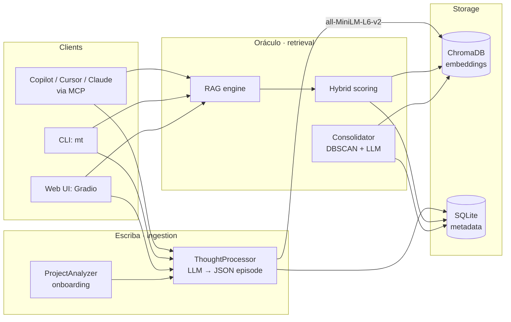

# Memory Twin

[](https://github.com/JesusJimenez01/memorytwin/actions/workflows/ci.yml)


[](LICENSE)

**Episodic memory for AI coding assistants.** Memory Twin captures the *reasoning* behind every
technical decision your assistant makes (alternatives considered, trade-offs, lessons learned),
stores it as searchable memory, and serves it back through the **Model Context Protocol (MCP)**,
so Copilot, Cursor or Claude stop repeating past mistakes and re-discussing settled decisions.

> AI assistants have no memory between sessions. Teams lose the *why* behind their code.
> Memory Twin turns that reasoning into a queryable knowledge base: **technical amnesia, solved.**

---

## Highlights

- **End-to-end LLM system**: LLM structuring → local embeddings → vector search with hybrid
  re-ranking → RAG answers, exposed as 14 MCP tools, a CLI and a web UI.
- **Memory that behaves like memory**: frequently recalled episodes are reinforced, critical
  decisions are boosted, known anti-patterns are surfaced as **warnings** before you repeat them,
  and related episodes are *consolidated* into higher-level "meta-memories" (DBSCAN + LLM synthesis).
- **Graceful degradation by design**: with no API key or with the LLM down, MCP captures are still
  stored and every retrieval tool keeps working, returning the relevant memories instead of an error.
- **Production-minded engineering**: typed Pydantic models, provider-agnostic LLM layer
  (OpenRouter / Gemini), retries with exponential backoff, optional Langfuse tracing,
  170+ tests with a coverage gate, lint and pre-commit hooks, CI on Python 3.11 and 3.12.

---

## How It Works

Memory Twin is split into two agents that share a dual storage backend:

- **Escriba** (the scribe) ingests raw reasoning and turns it into structured *episodes*.
- **Oráculo** (the oracle) retrieves, ranks and explains those memories on demand.


```mermaid
flowchart LR
    subgraph Clients
        A[Copilot / Cursor / Claude<br/>via MCP]
        B[CLI: mt]
        C[Web UI: Gradio]
    end

    subgraph Escriba [Escriba · ingestion]
        P[ThoughtProcessor<br/>LLM → JSON episode]
        O[ProjectAnalyzer<br/>onboarding]
    end

    subgraph Oraculo [Oráculo · retrieval]
        R[RAG engine]
        S[Hybrid scoring]
        K[Consolidator<br/>DBSCAN + LLM]
    end

    subgraph Storage
        V[(ChromaDB<br/>embeddings)]
        Q[(SQLite<br/>metadata)]
    end

    A & B & C --> P & R
    O --> P
    P -->|all-MiniLM-L6-v2| V
    P --> Q
    R --> S --> V
    S --> Q
    K --> V & Q
```

### 1. Capture and structuring

Free-form reasoning (or a structured `task / decision / reasoning` triple) is sent to an LLM with a
strict JSON schema: task, context, alternatives considered, decision factors, solution, tags and
lessons learned. The response is validated with Pydantic; malformed output (Markdown fences, extra
prose) is recovered by a tolerant JSON parser, and transient API failures are retried with
exponential backoff. If the LLM is unavailable, the MCP tools store a raw episode instead, so
knowledge is never lost.

### 2. Embedding and storage

Each episode is embedded locally with `sentence-transformers/all-MiniLM-L6-v2` (384 dimensions,
CPU, no API cost) and written to two stores: **ChromaDB** for vector search and **SQLite**
(SQLAlchemy) for the full record, flags and usage statistics.

### 3. Retrieval with hybrid scoring

Vector search over-fetches `3 × top_k` candidates and re-ranks them with:

```
score = cosine_similarity × (1 + 0.1 × access_count) × importance × modifiers
          modifiers: critical ×1.5 · anti-pattern ×0.3
```

Every time an episode is retrieved its `access_count` grows, so knowledge that keeps proving useful
is reinforced over time ("reinforcement without forgetting"). Anti-patterns are down-ranked in
normal results but promoted to explicit **WARNINGS** when relevant to the current topic.

### 4. Consolidation into meta-memories

Inspired by memory consolidation during sleep: episodes of a project are clustered with **DBSCAN**
over cosine distance (`eps=0.4`, `min_samples=3`, no need to guess the number of clusters, outliers
stay as individual episodes). Each cluster is summarized by the LLM into a *meta-memory* with the
common pattern, lessons, best practices and anti-patterns. Episodes already consolidated are skipped
on later runs, and the system recommends consolidation automatically once an episode is recalled
10+ times or 20+ episodes are pending.

### 5. Context for the assistant

`get_project_context` is the entry point agents call before answering. It returns, in priority
order: relevant anti-pattern warnings → meta-memories → episodes (the whole memory while it is
small, then the 5 most recent plus the 5 most relevant to the topic once it grows past 20 episodes).
`query_memory` goes one step further and generates a grounded RAG answer that cites its sources.

---

## Quick Start

### 1. Install

Memory Twin is installed once and used across all your projects. Python 3.11+ is required.

```bash
# Recommended: isolated global install with pipx
pipx install "git+https://github.com/JesusJimenez01/memorytwin.git"

# Optional extras: web UI and Langfuse tracing
pipx install "memorytwin[ui,observability] @ git+https://github.com/JesusJimenez01/memorytwin.git"
```

### 2. Configure a project

```bash
cd ~/my-project
mt setup
```

`mt setup` is non-destructive. It creates what is missing and merges what already exists:

| File | What happens |
|------|--------------|
| `AGENTS.md` | Instructions that teach your assistant to use the memory (kept if it already exists; `--force` overwrites) |
| `.vscode/mcp.json` | Registers the `memorytwin` MCP server, preserving any other servers |
| `.env` | Configuration template (never overwritten) |
| `.gitignore` | Adds `.env` and `data/` if missing |

Then add an LLM key to `.env` (OpenRouter offers free models):

```ini
OPENROUTER_API_KEY=your_key_here
LLM_PROVIDER=openrouter
LLM_MODEL=amazon/nova-2-lite-v1:free

# or Google Gemini
# GOOGLE_API_KEY=your_key_here
# LLM_PROVIDER=google
# LLM_MODEL=gemini-2.0-flash
```

### 3. Use it

Reload VS Code and your assistant will call Memory Twin automatically:

> **You**: Have we had authentication issues before?
>
> **Copilot**: *(calls `get_project_context(topic="authentication")`)* Yes. There is an
> anti-pattern warning: storing JWTs in `localStorage` exposed them to XSS; the fix was moving
> them to `httpOnly` cookies.

Or work from the terminal:

```bash
mt capture "Chose FastAPI over Flask for native async support" -p my-api
mt query "Why did we choose FastAPI?" -p my-api
mt chat -p my-api          # interactive session with the Oráculo
mt oraculo                 # web UI at http://127.0.0.1:7860
```

---

## CLI Reference

| Command | Description |
|---------|-------------|
| `mt setup [path] [--force]` | Configure Memory Twin in a project (AGENTS.md, MCP config, `.env`) |
| `mt onboard [path] [-v]` | Analyze an existing codebase (stack, patterns, dependencies, conventions) and store it as the first memory |
| `mt capture [text] [-f file] [-p project]` | Capture reasoning from an argument, a file or stdin |
| `mt search <query> [-k N]` | Semantic search over episodes |
| `mt query <question>` | RAG answer grounded on the memories |
| `mt chat` | Interactive Q&A session in the terminal |
| `mt lessons` | Aggregated lessons learned |
| `mt stats` | Episodes by type and assistant |
| `mt consolidate -p project [--force]` | Cluster episodes into meta-memories |
| `mt health-check` | Verify SQLite and ChromaDB are in sync |
| `mt mcp` | Start the MCP server (stdio) |
| `mt oraculo` | Launch the web UI (requires the `ui` extra) |

Memory commands accept `-p/--project` to scope the operation to one project.

## MCP Tools

| Tool | Purpose |
|------|---------|
| `get_project_context` | **Entry point.** Warnings, meta-memories and relevant episodes for a topic |
| `capture_thinking` | Store free-form reasoning (structured by the LLM) |
| `capture_decision` | Store a decision from `task`, `decision`, `reasoning`, `alternatives`, `lesson` |
| `capture_quick` | Minimal capture: `what` + `why` |
| `query_memory` | RAG answer to a question |
| `search_episodes` | Semantic search |
| `get_episode` | Full content of one episode |
| `get_timeline` | Chronological history |
| `get_lessons` | Aggregated lessons, filterable by tags |
| `get_statistics` | Memory statistics |
| `onboard_project` | Analyze a codebase and create the initial context |
| `mark_episode` | Flag as anti-pattern / critical, or mark as superseded |
| `consolidate_memories` | Generate meta-memories for a project |
| `check_consolidation_status` | Whether consolidation is recommended |

The server speaks JSON-RPC over stdio, so all logs and progress output go to stderr.

---

## Configuration

All settings are read from environment variables or a `.env` file in the working directory
(see [`.env.example`](.env.example)).

| Variable | Default | Description |
|----------|---------|-------------|
| `LLM_PROVIDER` | `openrouter` | `openrouter` or `google` |
| `LLM_MODEL` | `openrouter/auto` | Model used for structuring and answers |
| `OPENROUTER_API_KEY` / `GOOGLE_API_KEY` | | Key for the selected provider |
| `LLM_TEMPERATURE` | `0.3` | Temperature used to structure captures |
| `EMBEDDING_MODEL` | `all-MiniLM-L6-v2` | Local sentence-transformers model |
| `CHROMA_PERSIST_DIR` | `./data/chroma` | Vector store location |
| `SQLITE_DB_PATH` | `./data/memory.db` | Metadata database location |
| `GRADIO_SERVER_NAME` | `127.0.0.1` | Web UI bind address (localhost: the UI can delete episodes) |
| `GRADIO_SERVER_PORT` | `7860` | Web UI port |
| `LANGFUSE_PUBLIC_KEY` / `LANGFUSE_SECRET_KEY` / `LANGFUSE_HOST` | | Enable tracing (optional) |

Memories are stored **locally, per project**, in `data/` next to where `mt` runs. Nothing leaves
your machine except the text sent to the LLM provider you configure.

## Observability

With Langfuse credentials configured, every capture, retrieval and consolidation is traced
(LLM input/output, model parameters, number of episodes and meta-memories used). Tracing is a
no-op when the package or the credentials are missing.

- **Example trace from a real run**: [public Langfuse trace](https://cloud.langfuse.com/project/cmiq9jkds005rad065xzlt8p8/traces/650709800524916eb6c18deffdc35fa4?timestamp=2025-12-10T01:41:30.876Z)

---

## Development

```bash
git clone https://github.com/JesusJimenez01/memorytwin.git
cd memorytwin
python -m venv .venv && source .venv/bin/activate   # .venv\Scripts\activate on Windows
pip install -e ".[dev,ui]"
pre-commit install                                  # optional: lint on every commit

pytest                      # 170+ tests, LLM calls are mocked
pytest --cov                # coverage report (CI enforces >= 70%)
ruff check src/ tests/      # lint
```

### Project structure

```text
src/memorytwin/
├── config.py              # Settings + provider-agnostic LLM clients (OpenRouter, Gemini)
├── models.py              # Pydantic models: Episode, MetaMemory, queries and results
├── scoring.py             # Hybrid relevance scoring and consolidation triggers
├── consolidation.py       # DBSCAN clustering + LLM synthesis of meta-memories
├── observability.py       # Optional Langfuse tracing
├── escriba/               # Ingestion
│   ├── processor.py       #   LLM structuring with retries and tolerant JSON parsing
│   ├── storage.py         #   ChromaDB + SQLite dual storage
│   ├── project_analyzer.py #  Codebase onboarding analysis
│   └── cli.py             #   `mt` command-line interface
├── oraculo/               # Retrieval
│   ├── rag_engine.py      #   RAG over meta-memories and episodes, with LLM fallback
│   ├── oraculo.py         #   Interactive terminal session
│   └── app.py             #   Gradio web UI
├── mcp_server/
│   ├── server.py          # MCP server (stdio) and tool handlers
│   └── tools.py           # Tool JSON schemas
└── templates/             # Files generated by `mt setup`
```

### Design decisions and trade-offs

| Decision | Why | Trade-off |
|----------|-----|-----------|
| Local embeddings (MiniLM) instead of an embeddings API | Zero cost, offline, private, fast on CPU | Lower quality than large embedding models |
| ChromaDB + SQLite instead of a single store | Vector search where it shines, relational queries and counters where they belong | Two stores to keep in sync (`mt health-check`) |
| DBSCAN for consolidation | No preset number of clusters; outliers stay as individual memories | `eps` needs tuning for other embedding models |
| Reinforcement without time decay | Old but still-useful decisions keep their relevance | Obsolete knowledge must be marked explicitly (`mark_episode`) |
| LLM structuring at capture time | Rich, queryable episodes (alternatives, lessons, tags) | Latency and cost per capture; mitigated with free models and a raw fallback |

---

## Author

Designed and built by **Jesús Jiménez Pérez** · [GitHub](https://github.com/JesusJimenez01)

## License

MIT License. See [LICENSE](LICENSE) for details.
